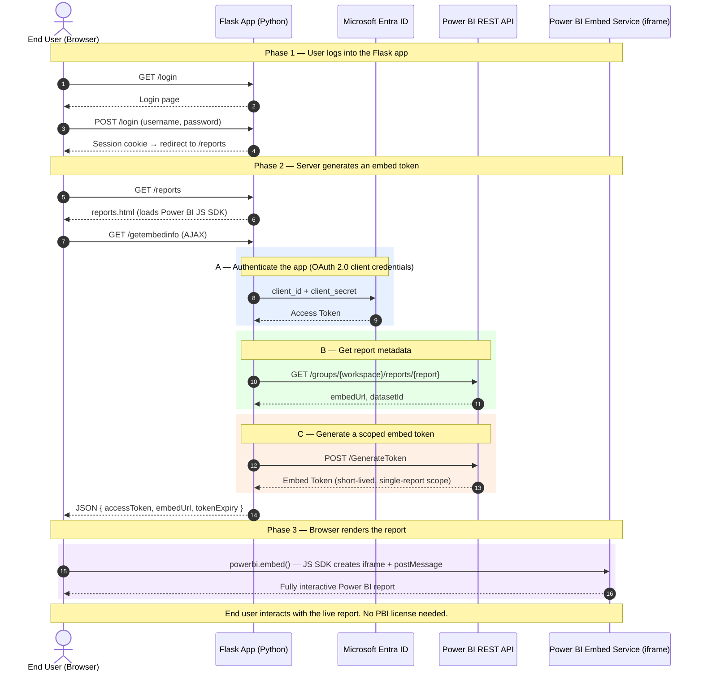

# Warning: The contents of this repo are intended for demo purposes only!

# Power BI Embedded Demo

A Python Flask web application that demonstrates embedding Power BI reports using the **App Owns Data** (embed for your customers) pattern. End users interact with fully interactive Power BI reports inside your app — no Power BI license required for them.

### Built with

| Technology | Role |
|---|---|
| [Flask](https://flask.palletsprojects.com/) | Lightweight Python web framework |
| [Click](https://click.palletsprojects.com/) | CLI argument parsing — no secrets in files |
| [MSAL](https://github.com/AzureAD/microsoft-authentication-library-for-python) | Microsoft Authentication Library (Azure AD / Entra ID) |
| [Power BI JS SDK](https://aka.ms/pbijs) | Client-side report embedding & interaction |
| [uv](https://docs.astral.sh/uv/) | Fast Python package manager |

---

## Architecture

This app uses the **App Owns Data** pattern: your server holds the credentials and authenticates with Power BI on behalf of end users. The user's browser only ever receives a short-lived, scoped embed token — never your secrets.



### What each phase does

| Phase | Where | What happens |
|---|---|---|
| **1 — Login** | Browser ↔ Flask | User authenticates with the web app (simple session auth). This has nothing to do with Power BI. |
| **2 — Token generation** | Flask → Entra ID → Power BI API | **(A)** Flask authenticates your registered app via OAuth client credentials. **(B)** Calls the Power BI REST API to get the report's embed URL and dataset ID. **(C)** Requests a scoped embed token that grants access to only this report. |
| **3 — Rendering** | Browser ↔ Power BI | The JS SDK creates an iframe, passes the embed token via `postMessage`, and Power BI's own viewer renders the full interactive report — slicers, cross-filtering, drill-through, page navigation — all working out of the box. |

### Two APIs in play

| API | Used where | Purpose |
|---|---|---|
| **Power BI REST API** | Python backend ([`aad_service.py`](src/app/services/aad_service.py), [`pbi_embed_service.py`](src/app/services/pbi_embed_service.py)) | Authenticate, fetch report metadata, generate embed tokens |
| **Power BI JS SDK** | Browser ([`embedding.js`](src/app/static/js/embedding.js)) | Render the report in an iframe, optional programmatic control (filters, events, navigation) |

---

## Prerequisites

| Requirement | Details |
|---|---|
| Python 3.14+ | <https://www.python.org/downloads/> |
| uv | <https://docs.astral.sh/uv/> |
| Azure AD app registration | [Register your app](https://learn.microsoft.com/en-us/power-bi/developer/embedded/register-app) |
| Power BI workspace & report | [Create a workspace](https://learn.microsoft.com/en-us/power-bi/developer/embedded/embed-sample-for-customers?tabs=python) |

### Azure AD setup (ServicePrincipal mode)

1. Register an app in **Microsoft Entra ID** → note the **Client ID** and **Tenant ID**
2. Create a **Client Secret** under *Certificates & secrets*
3. In Power BI Admin Portal → *Tenant settings* → enable **"Service principals can use Fabric APIs"**
4. Add the service principal as a **Member** or **Admin** of your Power BI workspace
5. Open your report in Power BI Service → copy the **Workspace ID** and **Report ID** from the URL:
   ```
   https://app.powerbi.com/groups/{WORKSPACE_ID}/reports/{REPORT_ID}/...
   ```

---

## Quick Start

```bash
# 1. Clone the repository
git clone https://github.com/hgrandy94/pbi-embedded-demo.git
cd pbi-embedded-demo/src

# 2. Install dependencies with uv
uv sync

# 3. Run the application — pass all secrets as CLI arguments
uv run python main.py \
  --tenant-id "YOUR_TENANT_ID" \
  --client-id "YOUR_CLIENT_ID" \
  --client-secret "YOUR_CLIENT_SECRET" \
  --workspace-id "YOUR_WORKSPACE_ID"
```

Open <http://localhost:5000> and log in with any user from `demo_users.json` (e.g. `admin` / `admin`).

> **Tip:** Run `uv run python main.py --help` to see every available option.

---

## CLI Options

All configuration is passed via command-line arguments — nothing is stored in repository files.

| Option | Required | Default | Description |
|---|---|---|---|
| `--tenant-id` | Yes | – | Azure AD / Microsoft Entra tenant ID |
| `--client-id` | Yes | – | Application (client) ID of the registered app |
| `--client-secret` | No | `""` | Client secret (required for ServicePrincipal mode) |
| `--workspace-id` | Yes | – | Power BI workspace ID containing the reports |
| `--report-id` | No | `""` | Optional default report ID (overrides per-user config) |
| `--users-config` | No | `demo_users.json` | Path to JSON file defining users and their report/RLS access |
| `--auth-mode` | No | `ServicePrincipal` | `ServicePrincipal` or `MasterUser` |
| `--pbi-user` | No | `""` | Master user email (MasterUser mode only) |
| `--pbi-pass` | No | `""` | Master user password (MasterUser mode only) |
| `--secret-key` | No | *(random)* | Flask session signing key |
| `--scope-base` | No | `https://analysis.windows.net/powerbi/api/.default` | OAuth scope |
| `--authority-url` | No | `https://login.microsoftonline.com/organizations` | Entra authority |
| `--port` | No | `5000` | Port for the Flask server |
| `--debug / --no-debug` | No | `--debug` | Flask debug mode |

---

## Project Structure

```
pbi-embedded-demo/
├── README.md                              # This file
├── pbi_embedded_setup_considerations.md   # Design decisions & RLS guidance
└── src/
    ├── main.py                            # Entry point — Click CLI
    ├── demo_users.json                    # Demo users, report access & RLS config
    ├── pyproject.toml                     # Project metadata & dependencies
    └── app/
        ├── __init__.py                    # Flask app factory
        ├── config.py                      # Default configuration reference
        ├── auth.py                        # Multi-user login / logout (Flask-Login)
        ├── views.py                       # Home, Reports, /api/reports & /getembedinfo
        ├── utils.py                       # Config validation
        ├── models/
        │   ├── embed_config.py            # EmbedConfig DTO
        │   ├── embed_token.py             # EmbedToken DTO
        │   ├── embed_token_request_body.py # Includes RLS identities
        │   └── report_config.py           # ReportConfig DTO
        ├── services/
        │   ├── aad_service.py             # Azure AD token acquisition (MSAL)
        │   └── pbi_embed_service.py       # Power BI REST API calls + RLS
        ├── templates/
        │   ├── base.html                  # Layout: topbar + sidebar with report list
        │   ├── login.html                 # Branded login page
        │   ├── home.html                  # Home with stat cards
        │   ├── reports.html               # Report picker + embedded viewer
        │   └── about.html                 # About & Help page
        └── static/
            ├── css/style.css              # Contoso Health design system
            └── js/embedding.js            # Multi-report embedding logic
```

---

## Key Code Walkthrough

### 1. Token acquisition ([`aad_service.py`](src/app/services/aad_service.py))

Uses MSAL to get an Azure AD access token via OAuth 2.0 client credentials:

```python
client_app = msal.ConfidentialClientApplication(
    CLIENT_ID, client_credential=CLIENT_SECRET, authority=authority
)
response = client_app.acquire_token_for_client(scopes=SCOPE_BASE)
```

### 2. Embed token generation ([`pbi_embed_service.py`](src/app/services/pbi_embed_service.py))

Two REST API calls:

```python
# Get report metadata (embed URL, dataset ID)
requests.get(f"https://api.powerbi.com/v1.0/myorg/groups/{workspace}/reports/{report}")

# Generate a scoped embed token
requests.post("https://api.powerbi.com/v1.0/myorg/GenerateToken",
    data=json.dumps({"datasets": [...], "reports": [...], "targetWorkspaces": [...]}))
```

### 3. Client-side embedding ([`embedding.js`](src/app/static/js/embedding.js))

The Power BI JS SDK renders the report inside a `<div>`:

```javascript
powerbi.embed(reportContainer, {
    type: "report",
    tokenType: models.TokenType.Embed,
    accessToken: data.accessToken,
    embedUrl: data.reportConfig[0].embedUrl,
});
```

This creates an iframe running Power BI's own report viewer — all interactivity (slicers, cross-filtering, drill-through, page navigation) works automatically.

---

## References

- [Power BI Developer Samples (Python)](https://github.com/microsoft/PowerBI-Developer-Samples/tree/master/Python/Embed%20for%20your%20customers)
- [Tutorial: Embed for your customers](https://learn.microsoft.com/en-us/power-bi/developer/embedded/embed-sample-for-customers?tabs=python)
- [Power BI JavaScript SDK](https://aka.ms/pbijs)
- [Power BI JS SDK API Reference](https://learn.microsoft.com/en-us/javascript/api/overview/powerbi/)
- [Power BI REST API](https://learn.microsoft.com/en-us/rest/api/power-bi/)

---

## Security

> **All secrets are passed as CLI arguments and never committed to the repository.**
>
> For production deployments:
> - Feed arguments from a vault service (Azure Key Vault, CI/CD secrets, etc.)
> - Replace the demo session login with a proper identity provider (Entra ID, OAuth, SAML)
> - Use HTTPS and set `--no-debug`
